# Mermaid diagrams

## Flowchart

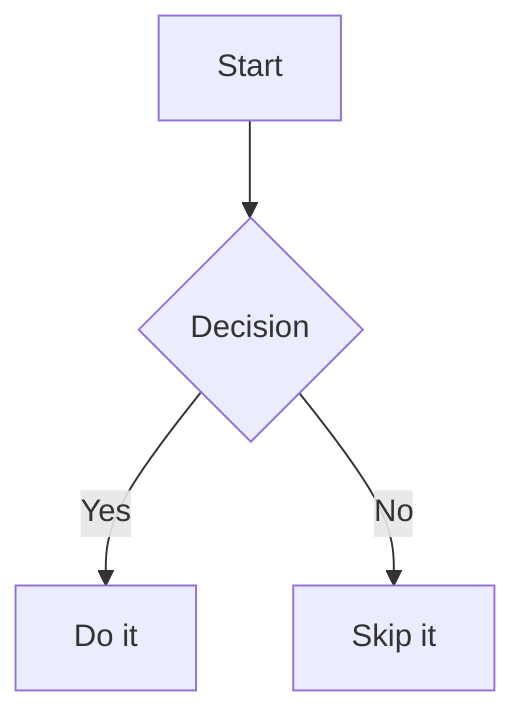

## Sequence diagram

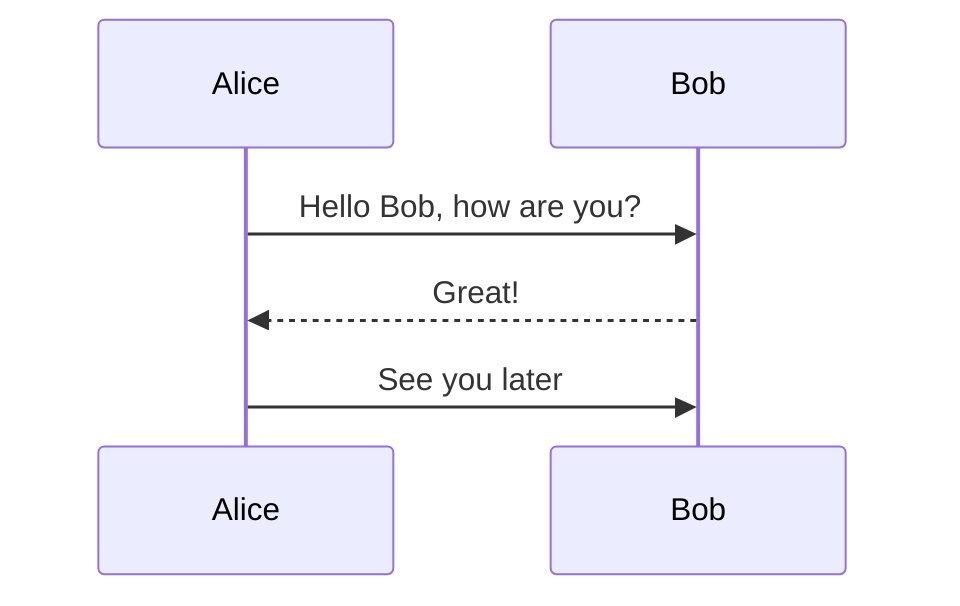

## Class diagram

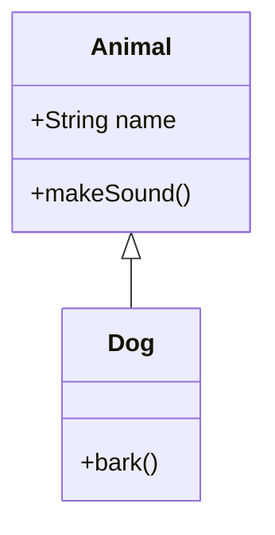

## State diagram

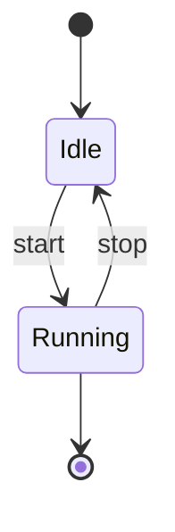

## Entity relationship diagram

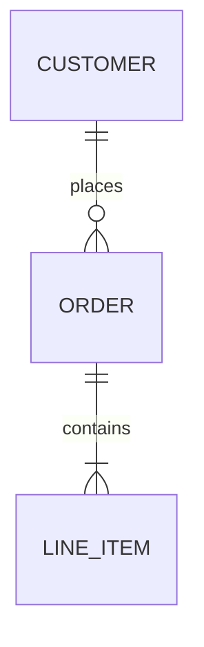

## Gantt chart

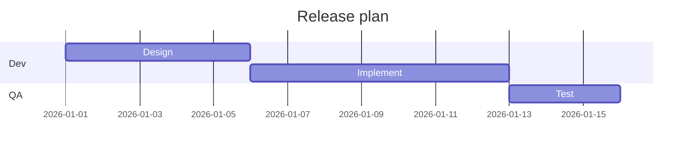

## Pie chart

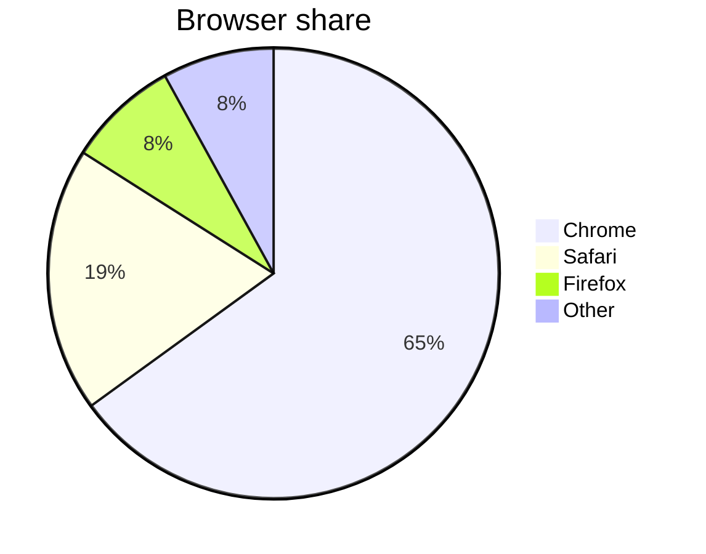

## User journey

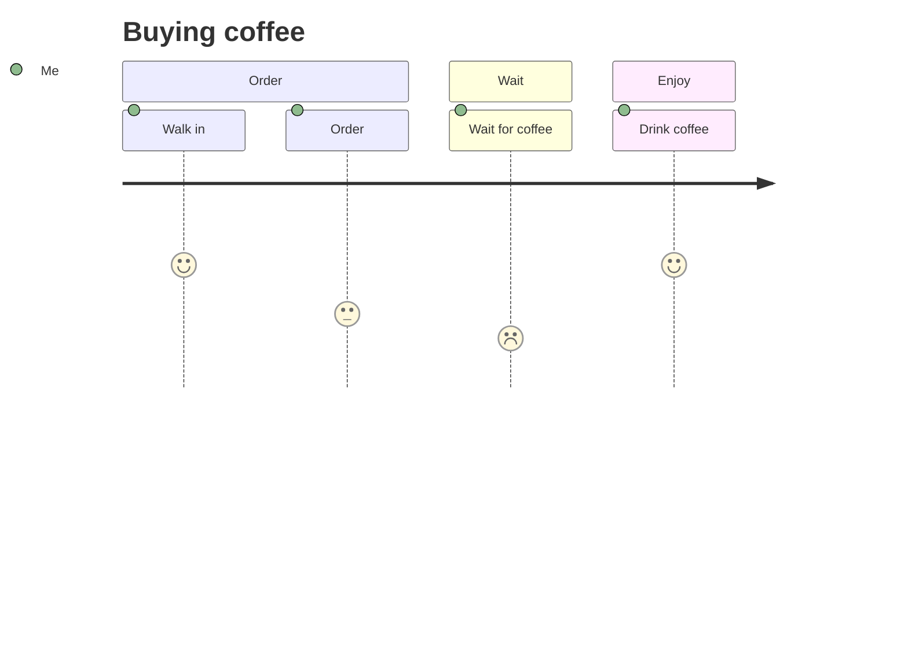

## Git graph

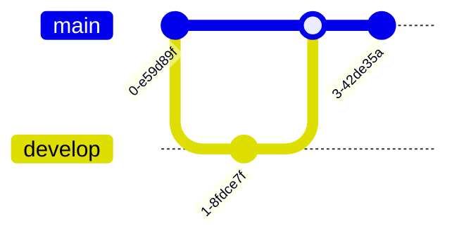

## Mindmap

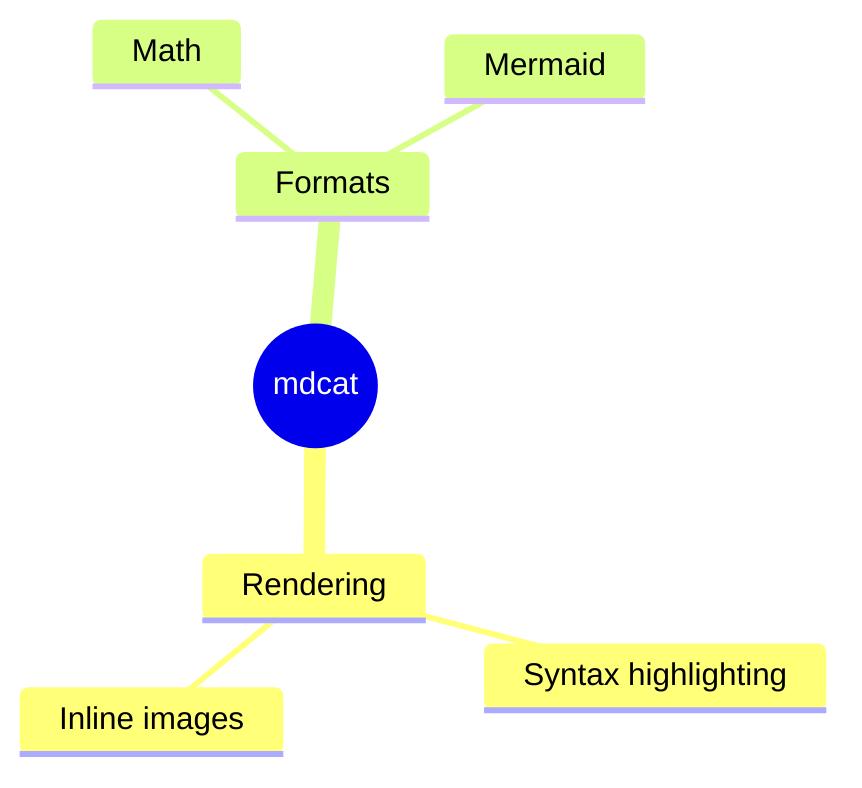

## Timeline

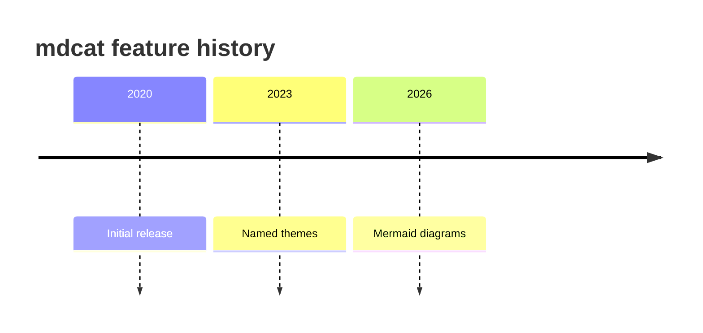

## Quadrant chart

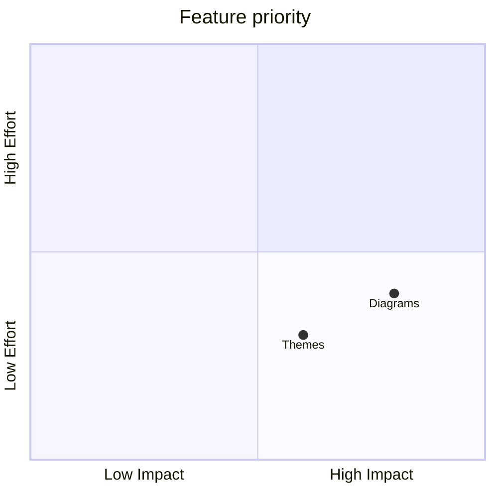
